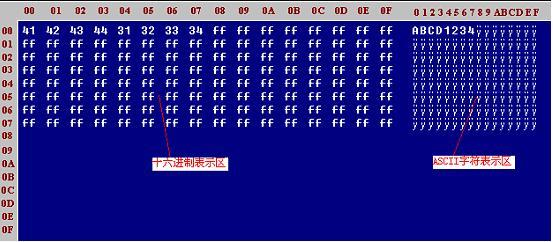

**DCULC接触式读写器**

DCULC接触式读写器相关型号：

`    `RD600W-ULC， RD600-ULC， RD600S-ULC， RD600P-ULC, D6-ULC

支持卡类型：

` `24C01A/02/04/08/16系列,24C64卡,4432/4442系列,4418/4428系列,CPU卡

各种读卡器的一些问题：

1 卡片芯片朝上朝下问题\
`   `卡片在读卡器中芯片朝上或朝下的问题，是根据读卡器的型号的不同而有区别的：RD600、RD600U、RD600P、RD600W-T、RD600S-T、RD600S-U-T读卡器中的卡片芯片朝上； RD600W-B、RD600S-B、RD600S-U-B读卡器中的卡片芯片朝下。

2 自动测卡问题\
`   `RD600演示程序中的自动测卡功能仅供参考，不是判断卡型的唯一标准，因为在测卡时读的是特征字节，而卡的特征字节有可能因卡的生产商不同而有所不同，当测卡不准时，请手动选卡型号。

3 验证密码问题\
`   `接触式读卡器在验证密码时，如果在前一次核对密码正确后而没下电的情况下，无论输入任何密码它都认为是正确的，只有下电后才能判断密码的正确与否。

4  USB读卡器\
`     `在使用USB读卡器时，不能先接读卡器，而是应该先安装USB驱动，然后再接上USB读卡器，这时系统会自动找到设备的。

5 IC\_InitType\
`   `此函数不是测卡函数，它没有测卡功能，它的作用是告诉读卡器将要操作的卡型号而已。

6 初始化串口错误\
`   `串口资源已经被占用，（包括初始化串口后非正常退出而未关闭串口，然后再去初始化串口）； 计算机与读写器通讯的波特率与读写器默认波特率不一致；计算机与读写器通讯的串口与读写器默认串口不一致；设备连接不正确，接触不正常。

1.\
\_\_int16 IC\_Status(HANDLE ICDev)\
\
说明：返回所连接的读写卡器的当前状态，测试读写卡器有没有连接或有没有插卡\
\
`      `**对于USB接口的读写器，该函数同时起上电作用，对卡操作前必须执行。**\
\
调用：HANDLE ICDev ----IC\_InitComm 函数返回的端口标识符\
\
返回：<0 读写器连接错误，见错误码\
\
`      `=0 连接正确，并且已经插卡\
\
`      `=1 连接正确，但读写器内没有插卡\
\
举例：St=IC\_Status(ICDev)

2.\
\_\_int16 IC\_Down(HANDLE ICDev)\
\
`    `说明：对卡下电，对于逻辑加密卡，下电后必须密码变为有效，即要写卡必须重新校验密码。\
\
`    `调用：HANDLE ICDev ---- IC\_InitComm 函数返回的端口标识符\
\
`    `返回：<0 错误。其绝对值为错误号，错误号请对照错误码表。\
\
`          `=0 正确.\
\
举例：St=IC\_Down(ICDev)\
\
**注意：对于所有的逻辑加密卡，校验密码正确后，如果没有执行下电操作而且卡也没有从读写器拔出，则校验一直有效。** 

3.\
HANDLE IC\_InitComm(\_\_int16 Port)\
\
说明：初始化端口，计算机要和读写器通讯，必须按一定的通讯格式，\
\
`      `该函数对计算机的端口进行初始化，以便于计算机能和读写器进行通讯。\
\
`      `**该函数是对读写器操作的第一步。**\
\
调用：Port ----等于100是表示连接的是USB接口\
\
返回：<=0 错误，没有初始化成功，所以不能进行以后的操作\
\
`      `>0 初始化成功，返回端口标识符\
\
举例：ICDev=InitComm(100) 打开USB端口。

4.\
\_\_int16 IC\_ExitComm(HANDLE ICDev)\
\
说明：关闭端口，在Windows系统中，同时只能有一个设备使用端口， \
\
`      `所以在退出系统时，请关闭端口，以便于其它设备使用。\
\
调用：HANDLE ICDev ---- IC\_InitComm 函数返回的端口标识符 \
\
返回：<0 端口没能正常关闭，可能要关闭系统来关闭端口\
\
`      `>=0 通讯设备正常关闭\
\
举例：IC\_ExitComm(ICDev) 关闭ICDev指定的端口。 

5.\
\_\_int16 IC\_InitType (HANDLE ICDev,\_\_int16 TypeNo)\
\
说明：在对IC卡进行操作之前，请先告诉读卡器你要操作什么卡，因此要用该函数进行卡型设置。\
\
调用：HANDLE ICDev ---- [IC_InitComm](#chmtopic8) 函数返回的端口标识符\
\
`      `\_\_int16 TypeNo ---- 卡类型号，请参照[IC卡类型代码表\
](#chmtopic12)\
返回：<0 错误。其绝对值为[错误号](#chmtopic13)\
\
`      `=0 操作正确\
\
举例：IC\_InitType(HANDLE ICDev,0x20)\
\
`      `设置卡类型为ATMEL102型

6.\
\_\_int16 IC\_Read (HANDLE ICDev,\_\_int16 Offset,\_\_int16 \
\
len, unsigned char \* DataBuffer)\
\
说明：该函数用来读取IC卡内数据\
\
`      `即根据偏移量，长度等参数进行卡内数据读取\
\
调用：HANDLE ICDev----IC\_InitComm函数返回的端口标识符\
\
`      `\_\_int16 Offset---- 读数据IC卡起始地址\
\
`      `\_\_int16 Len ---- 数据长度\
\
`      `unsigned char \* Databuffer---- 存放数据的缓冲区\
\
返回：<0 错误。其绝对值为错误号\
\
`      `=0 读取数据正确\
\
举例：IC\_Read(ICDev,16,64,DataBuffer)\
\
`      `读取16至79的数据到DataBuffer。 

相关HEX函数：

`      `\_\_int16 IC\_Read\_Hex(HANDLE idComDev,\_\_int16 offset,\_\_int16 len,unsigned char \* databuffer)

7．\
\_\_int16 IC\_Write (HANDLE ICDev, \_\_int16 Offset,\_\_int16 len, unsigned char\* DataBuffer)\
\
说明：将数据写到IC卡上。\
\
调用：HANDLE ICDev ----IC\_InitComm 函数返回的端口标识符\
\
`      `\_\_int16 Offset ---- 写IC卡起始地址\
\
`      `\_\_int16 length ---- 数据的长度\
\
`      `unsigned char \* Databuffer---- 即将写入IC卡的数据\
\
返回：<0 错误。其绝对值为错误号\
\
`      `=0 写入数据成功\
\
举例：IC\_Write(ICDev,32,14,"IcCard Message") \
\
`      `将IcCard Message写入从32地址开始的数据区。 

相关HEX函数：

`      `\_\_int16 IC\_Write\_Hex(HANDLE idComDev,\_\_int16 offset,\_\_int16 len,unsigned char \* writebuffer)

8.

**int IC\_CheckCard(HANDLE icdev)**

说明：自动测卡类型，此函数判断出的卡型仅供参考，以卡片供应商为准。

调用：icdev: 通讯设备标识符

返回：>0 正确；卡类型请参照返回码对应的[卡型代码表](#chmtopic20)

举例：

int st;

st=IC\_CheckCard(icdev);

9.

int IC\_ReadVer(HANDLE icdev,unsinged char \*data\_buff);

说明：读设备硬件版本号

调用：HANDLE ICDev ---- IC\_InitComm 函数返回的端口标识符\
\
`      `unsinged char \*data\_buff ---- 存放读出的信息，长度9字节。

返回：<0 错误

` `=0 正确

**\_\_int16 asc2hex(unsigned char \*strasc,unsigned char \*strhex,\_\_int16 length)**

功 能：字符串转换函数，普通字符转换成十六进制字符。（短转长）

参 数：**strasc**：要转换的字符

`       `**strhex**：转换后的字符

`       `**length**：字符**strasc**的长度

返 回：成功则返回 0

**\_\_int16 hex2asc(unsigned char \*strhex,unsigned char \*strasc,\_\_int16 length)**

功 能：字符串转换函数，十六进制字符转换成普通字符。（长转短）

参 数：**strhex**：要转换的字符

`       `**strasc**：转换后的字符

`       `**length**：字符**strasc**的长度

返 回：成功则返回 0

1. \
\_\_int16 IC\_ReadProtection (HANDLE ICDev,\_\_int16 Offset,\_\_int16 len,unsigned char\* ProtBuffer)\
\
说明：读取IC卡保护位\
\
调用：HANDLE ICDev ---- IC\_InitComm 函数返回的端口标识符\
\
`      `\_\_int16 Offset ---- 读保护位IC卡起始地址\
\
`      `\_\_int16 Len ---- 数据长度\
\
`      `unsigned char \* Databuffer ---- 存放数据的缓冲区\
\
`      `数据值为0表示保护位已置 ,1表示未置保护\
\
返回：<0 错误。其绝对值为错误号\
\
`      `=0 读保护位成功\
\
举例：IC\_ReadProtection(ICDev,0,32,ProtBuffer)\
\
`      `读取地址0～31的保护位数据，ProtBuffer 为0的字节表示对应的字节保护位已置。 

相关HEX函数:\
\
`      `\_\_int16 IC\_ReadProtection\_Hex(HANDLE idComDev,\_\_int16 offset,\_\_int16 len,unsigned char\* protbuffer)

2．\
\_\_int16 IC\_WriteProtection (HANDLE ICDev, \_\_int16 Offset, \_\_int16 len,unsigned char \*ProtBuffer)\
\
说明：写IC卡保护位\
\
调用：HANDLE ICDev ---- IC\_InitComm函数返回的端口标识符\
\
`      `\_\_int16 Offset ---- 写IC卡保护位起始地址\
\
`      `\_\_int16 len ---- 保护位数 \
\
`      `unsigned char \*ProtBuffer ---- 要置保护位的数据内容，其内容必须与卡中现存的内容相同，否则不能置写保护。\
\
返回：<0 错误。其绝对值为错误号\
\
`      `=0 写入保护位字节数\
\
举例：ProtBuffer="DCIC"\
\
`      `IC\_WriteProtection(ICDev,16,4,ProtBuffer)\
\
`      `将16,17,18,19位置保护 

相关HEX函数:\
\
`      `\_\_int16 IC\_WriteProtection\_Hex(HANDLE idComDev,\_\_int16 offset,\_\_int16 len,unsigned char \*protbuffer)

3. \
\_\_int16 IC\_ReadCount\_SLE4442 (HANDLE ICDev)\
\
说明：读取西门子4442卡密码计数器值\
\
调用：HANDLE ICDev ----IC\_InitComm 函数返回的端口标识符\
\
返回：<0 错误。其绝对值为错误号\
\
`      `>=0 密码计数器计数值。此值表示试密码的机会。\
\
举例：IC\_ReadCount\_SLE4442(ICDev)

4. \
\_\_int16 IC\_CheckPass\_SLE4442 (HANDLE ICDev, unsigned char\* Password)\
\
说明：校验密码（专用于 4442卡）\
\
调用：HANDLE ICDev ---- IC\_InitComm 函数返回的端口标识符\
\
`      `unsigned char \* Password ---- 卡密码 3字节\
\
返回：<0 错误。其绝对值为错误号\
\
`      `=0 校验密码正确\
\
举例：pass[3]={0xff,0xff,0xff};\
\
`      `IC\_CheckPass\_SLE4442(ICDev,pass);\
\
`      `校验密码为ffffff的卡 

相关HEX函数:\
\
`      `\_\_int16 IC\_CheckPass\_4442hex(HANDLE idComDev,unsigned char\*password)

5. \
\_\_int16 IC\_ChangePass\_SLE4442 (HANDLE ICDev, unsigned char\* Password)\
\
说明：更改密码（专用于4442卡）。更改完密码后，如果卡片执行下电操作，\
\
`      `如需写操作或再次更改密码操作，必须再次核对密码。\
\
调用：HANDLE ICDev ---- IC\_InitComm 函数返回的端口标识符\
\
`      `unsigned char \* Password ---- 新密码 3字节\
\
返回：<0 错误。其绝对值为错误号\
\
`      `=0 更改密码正确\
\
举例：IC\_ChangePass\_SLE4442(ICDev,"222")\
\
`      `将密码改为222。 

相关HEX函数:

`      `\_\_int16 IC\_ChangePass\_4442hex(HANDLE idComDev,unsigned char\*password)

6. \
\_\_int16 IC\_Check\_4442 (HANDLE ICDev)\
\
说明：检查读写设备中是否有4442卡插入\
\
调用：HANDLE ICDev ---- [IC_InitComm](#chmtopic8) 函数返回的端口标识符\
\
返回：<0 错误。其绝对值为[错误号](#chmtopic13)\
\
`      `=0 正确

7. \
\_\_int16 IC\_ReadPass\_SLE4442 (HANDLE ICDev, unsigned char\* Password)\
\
说明：读卡密码（专用于 4442卡）\
\
调用：HANDLE ICDev ---- IC\_InitComm 函数返回的端口标识符\
\
`      `unsigned char \* Password ---- 存放数据的缓冲区 \
\
返回：<0 错误。其绝对值为错误号\
\
`      `=0 读密码正确 

相关HEX函数:\
\
`      `\_\_int16 IC\_ReadPass\_4442hex(HANDLE idComDev,unsigned char\*password)

1. \
\_\_int16 IC\_ReadWithProtection (HANDLE ICDev,\_\_int16 Offset,\_\_int16 len,unsigned char\* ProtBuffer)\
\
说明：带保护位读IC卡。\
\
调用：HANDLE ICDev ---- IC\_InitComm 函数返回的端口标识符\
\
`      `\_\_int16 Offset ---- 读保护位IC卡起始地址\
\
`      `\_\_int16 Len ---- 数据长度\
\
`      `unsigned char \* ProtBuffer ---- 存放数据的缓冲区 \
\
`      `此缓冲区包括两部分内容：\
\
`      `第一部分为卡中的数据，长度为Len所表示的长度；\
\
`      `第二部分为相应的保护位内容， "0"表示保护位已置，"1"表示未置保护，\
\
`      `第二部分从偏移地址Len开始，也是Len个字节。\
\
返回：<0 错误。其绝对值为错误号\
\
`      `>=0 有效数据长度。表示ProtBuffer数据的有效字节数。\
\
举例：IC\_ReadWithProtection(ICDev,0,32,ProtBuffer) \
\
`      `读取地址0～31的数据和其相应的保护位，ProtBuffer的0－31个字节为卡中数据，\
\
`      `从第32位开始ProtBuffer每一字节为"0"表示对应的保护位已置，为"1"则相反。\
\
注意：ProtBuffer所指缓冲区的长度必须为2\*Len，否则将导致错误。 

相关HEX函数:\
\
`      `\_\_int16 IC\_ReadWithProtection\_Hex(HANDLE idComDev,\_\_int16 offset,\_\_int16 len,unsigned char\* protbuffer)

2. \
\_\_int16 IC\_WriteWithProtection (HANDLE ICDev, \_\_int16 Offset, \_\_int16 len,unsigned char \*ProtBuffer)\
\
说明：写IC卡的同时置保护位\
\
调用：HANDLE ICDev ---- IC\_InitComm 函数返回的端口标识符\
\
`      `\_\_int16 Offset ---- 写IC卡保护位起始地址\
\
`      `\_\_int16 len ---- 保护位数\
\
`      `unsigned char \*ProtBuffer ---- 要置保护位的数据内容 \
\
返回：<0 错误。其绝对值为错误号\
\
`      `=0 写入保护位字节数\
\
举例：ProtBuffer="DCIC"\
\
`      `IC\_WriteWithProtection(ICDev,16,4,ProtBuffer)\
\
`      `对16,17,18,19位写入"DCIC"并置写保护 

相关HEX函数:\
\
`      `\_\_int16 IC\_WriteWithProtection\_Hex(HANDLE idComDev,\_\_int16 offset,\_\_int16 len,unsigned char \* writebuffer)

3. \
\_\_int16 IC\_ReadCount\_SLE4428 (HANDLE ICDev)\
\
说明：读取西门子4428卡密码计数器值\
\
调用：HANDLE ICDev ---- IC\_InitComm 函数返回的端口标识符\
\
返回：<0 错误。其绝对值为错误号\
\
`      `>=0 密码计数器计数值。此值表示试密码的机会。\
\
举例：IC\_ReadCount\_SLE4428(ICDev)

4. \
\_\_int16 IC\_CheckPass\_SLE4428 (HANDLE ICDev, unsigned char\* Password)\
\
说明：校验密码（用于4428型）\
\
调用：HANDLE ICDev ---- IC\_InitComm 函数返回的端口标识符\
\
`      `unsigned char \* Password ---- 卡密码(2字节)\
\
返回：<0 错误。其绝对值为错误号\
\
`      `=0 校验密码正确\
\
举例：IC\_CheckPass\_SLE4428(ICDev,"11")\
\
`      `校验密码为11的卡。 

相关HEX函数:\
\
`      `\_\_int16 IC\_CheckPass\_4428hex(HANDLE idComDev,unsigned char\* password)

5. \
\_\_int16 IC\_ChangePass\_SLE4428 (HANDLE ICDev, unsigned char\* Password)\
\
说明：更改密码（用于4428型）\
\
调用：HANDLE ICDev ---- IC\_InitComm 函数返回的端口标识符\
\
`      `unsigned char \* Password ---- 新密码(2字节)\
\
返回：<0 错误。其绝对值为错误号\
\
`      `>0 更改密码正确\
\
举例：IC\_ChangePass\_SLE4428(ICDev,"22")\
\
`      `将密码改为22。 

相关HEX函数:\
\
`      `\_\_int16 IC\_ChangePass\_4428hex(HANDLE idComDev,unsigned char\* password)

6. \
\_\_int16 IC\_Check\_4428(HANDLE ICDev)\
\
说明：检查读写设备中是否有4428卡插入\
\
调用：HANDLE ICDev ---- [IC_InitComm](#chmtopic8) 函数返回的端口标识符\
\
返回：<0 错误。其绝对值为错误号\
\
`      `=0 正确

<7>24系列卡专用函数（该函数用于24C01A/02/04/08/16）\
\
1\. \
\_\_int16 IC\_Write24 (HANDLE ICDev, \_\_int16 Offset,\_\_int16 length, unsigned char\* DataBuffer)\
\
说明：写数据到IC卡\
\
调用：HANDLE ICDev ---- IC\_InitComm 函数返回的端口标识符\
\
`      `\_\_int16 Offset ---- 写IC卡起始地址\
\
`      `\_\_int16 length ---- 数据的长度\
\
`      `unsigned char \* Databuffer ---- 即将写入IC卡的数据\
\
返回：<0 错误。其绝对值为错误号\
\
`      `=0 成功\
\
举例：IC\_Write24(ICDev,32,14,"IcCard Message")\
\
`      `将"IcCard Message"写入从32地址开始的数据区。 

相关HEX函数:\
\
`      `\_\_int16 IC\_Write24\_Hex(HANDLE idComDev,\_\_int16 offset,\_\_int16 len,unsigned char \*writebuffer\_\_)

2. \
\_\_int16 IC\_Check\_24C01(HANDLE ICDev)\
\
说明：检查读写设备中是否有24C01卡插入\
\
调用：HANDLE ICDev ---- [IC_InitComm](#chmtopic8) 函数返回的端口标识符\
\
返回：<0 错误。其绝对值为[错误号](#chmtopic13)\
\
`      `=0 正确 

其它AT24C系列的测卡函数的函数原形为：

int IC\_Check\_24Cxx(HANDLE icdev)；//其中xx为02、04、08、16

\
IC\_Write64()同IC\_Write24卡作用相同，只是专用于24C64卡 

相关HEX函数:\
\
`    `\_\_int16 IC\_Write64\_Hex(HANDLE idComDev,\_\_int16 offset,\_\_int16 len,unsigned char \*writebuffer)

2. \
\_\_int16 IC\_Check\_24C64(HANDLE ICDev)\
\
说明：检查读写设备中是否有24C64卡插入\
\
调用：HANDLE ICDev ---- [IC_InitComm](#chmtopic8) 函数返回的端口标识符\
\
返回：<0 错误。其绝对值为错误号\
\
`      `=0 正确

1．\
\_\_int16 IC\_CpuReset(HANDLE ICDev,unsigned char \*rlen, unsigned char \*rbuff)\
\
说明：CPU卡上电复位函数，复位后自动判断卡片协议\
\
调用：int ICDev ---- IC\_InitComm 函数返回的端口标识符\
\
`      `unsigned char \*rlen ---- 返回复位信息的长度\
\
`      `unsigned char \* rbuff ---- 存放返回的复位信息\
\
返回： <0 错误。其绝对值为错误号\
\
`      `=0 成功。\
\
举例：st=IC\_CpuReset(ICDev,rlen,DataBuffer) 

相关HEX函数：\
\
`      `\_\_int16 IC\_CpuReset\_Hex(HANDLE idComDev,unsigned char \*rlen, unsigned char \*databuffer)

2．\
\_\_int16 IC\_CpuApdu(HANDLE ICDev,unsigned char slen,unsigned char \* sbuff,unsigned char \*rlen,unsigned char \* rbuff)\
\
说明：CPU卡APDU（应用协议数据单元）信息交换函数。该函数封装了T=0和T=1操作 \
\
调用：int ICDev ---- IC\_InitComm 函数返回的端口标识符\
\
`      `unsigned char \*slen ---- 发送的信息长度\
\
`      `unsigned char \* sbuff ---- 存放要发送的信息\
\
`      `unsigned char \*rlen ---- 返回信息的长度\
\
`      `unsigned char \* rbuff ---- 存放返回的信息\
\
返回： <0 错误。其绝对值为错误号\
\
`      `=0 成功。\
\
举例：int st;\
\
`      `unsigned char slen,rlen,sneddata[100], recdata[100]; \
\
`      `slen=5;\
\
`      `senddata[0]=0x00;senddata[1]=0x84;senddata[2]=0x00;\
\
`      `senddata[3]=0x00;senddata[4]=0x04;\
\
`      `st= IC\_CpuApdu ( icdev,slen,senddata,&rlen,recdata)\
\
`      `对卡发取随机数命令 

相关HEX函数：\
\
`      `\_\_int16 IC\_CpuApdu\_Hex(HANDLE idComDev,unsigned char slen,unsigned char \* sendbuffer,unsigned char \*rlen,unsigned char \* databuffer)

3．\
\_\_int16 IC\_CpuGetProtocol(HANDLE ICDev)\
\
说明：得到CPU卡的协议 \
\
调用：int ICDev ---- IC\_InitComm 函数返回的端口标识符\
\
返回： <0 错误。其绝对值为错误号\
\
`      `=0 T=0协议 \
\
`      `=1 T=1协议

4. \
\_\_int16 IC\_Check\_CPU(HANDLE ICDev)\
\
说明：检查读写设备中是否有CPU卡插入\
\
调用：HANDLE ICDev ---- [IC_InitComm](#chmtopic8) 函数返回的端口标识符\
\
返回：<0 错误。其绝对值为错误号\
\
`      `=0 CPU（T=0）；=1 CPU（T=1） 

**附录 几种常用IC卡的特性** 

**1. AT24C01A/02/04/08/16/64卡**\
`    `该系列IC卡均为非加密存储卡，容量分别为1K，2K，4K，8K，16K，64K bit，只有读、写两种操作。\
\
**2. AT45D041卡**\
`    `AT45D041卡是非加密存储卡，容量为4M bit，整卡分为2048页，每页有264 byte 。只有读、写两种操作。\
\
**3. AT88SC102卡**\
`    `AT88SC102为加密存储卡，容量为1K bit。整卡分两个应用区，容量均为64 byte。熔丝熔断前，各区的读、写和擦除，受总密码和读写保护位的控制，数据按字节擦除；熔丝熔断后，各区的读、写和擦除，受总密码、读写属性控制位和擦除密码的控制，只要正确核对分区擦除密码，整区数据将自动擦除。\
\
**4. AT88SC1601/1604卡**\
`    `AT88SC1601是加密存储卡，容量为16K bit。整卡分为一个公用区和四个应用区，个人化之前，整个卡的访问受总密码和读写保护位的控制。个人化之后，各区的读、写和擦除都要受总密码、分区密码、分区擦除密码和读写保护位的控制。1604 与1601卡基本相同，它们的区别是：各个分区的容量不同；1601只是1区有密码计数器 ，而1604的4个分区都有密码计数器。\
\
**5. SLE4432/4442卡**\
`    `SLE4442为加密存储卡，容量为256 byte。总密码核对正确之后，才可以对卡读、写操作。该卡前32字节可进行写保护位操作。总密码错误计数器值为3，核对错误一次，减1操作，若计数值为0，整卡数据锁死。若3次内有一次核对正确，则计数器恢复初值。SLE4432特性与4442相似，但无密码操作功能。\
\
**6. SLE4418/4428卡**\
`    `SLE4428为加密存储卡,容量为1K byte。总密码核对正确之后，才可以对卡读、写操作。该卡所有数据均可以写保护(固化数据)。总密码错误计数器值为8。    SLE4418特性与4428相似，但无密码操作功能。\
\
**7. SLE4404卡**\
`    `SLE 4404是加密存储卡，容量为52 byte。。该卡有一个数据区，容量为26 byte，其读、写和擦除操作受总密码、读写属性控制位及擦除密码的控制。注意：核对正确擦除密码后，数据区的内容全部擦除（为0xff），然后才可以写入新的数据。\
\
**8. SLE4406卡**\
`    `SLE 4406卡是加密存储卡，容量为13 byte。个人化前，总密码和密码计数器起作用，每核对一次密码，计数器值减1。个人化后，密码无效，密码区和计数器区成为数据区的一部分；对数据区只能做减值操作。\
\
**9. AT88SC1608卡**\
`    `1608卡是一种带认证功能的逻辑加密卡，共有8个用户数据区，每一个区有256字节，一个配置区，用于存放认证数据及读写密码用。用户区也可动态分配为任意小于8个的区。使用比较方便。AT88SC153为三个用户区（每区为64个字节）的功能特别相近的一种逻辑加密卡。\
\
**10. SSF1101**\
`    `SSF1101卡是非加密存储卡，容量为4M bit，整卡分为512页，每页有1024 byte 。只有读、写两种操作。

**IC卡类型代码:**

[IC_InitType](#chmtopic14) (HANDLE ICDev,\_\_int16 TypeNo) TypeNo参数表：\
\
`  `**代码          卡类型**\
\
`   `4  (0x04)       4418、4428系列\
\
`  `12 (0x0c)       CPU卡(主卡装)\
\
`  `16 (0x10)       4432/4442系列\
\
`  `64 (0x40)       24C01A/02/04/08/16系列\
\
`  `192(0xc0)       24C64卡

\
**函数错误类型代码:**\
\
-0x01(001)： 通用错误\
\
-0x02(002)： 不支持该函数\
\
-0x03(003)： 卡型号错误\
\
-0x20(032)： 打开串口错误\
\
-0x21(033)： 获取串口状态错误\
\
-0x22(034)： 设置串口状态错误\
\
-0x23(035)： 关闭串口错误\
\
-0x24(036)： 串口已打开\
\
-0x25(037)： 设置串口缓存错误\
\
-0x26(038)： 设置串口延时错误\
\
-0x27(039)： 通讯错误\
\
-0x35(053)： 函数使用不符错误\
\
-0x80(128)： 读错误\
\
-0x81(129)： 写错误\
\
-0x82(130)： 校验密码错误\
\
-0x83(131)： 异或和校验错误\
\
-0x84(132)： 通讯超时\
\
-0x85(133)： 校验密码错误\
\
-0x86(134)： 无卡错误\
\
-0x87(135)： 函数参数格式错误

**Hex为后缀的函数说明**

字符的描述方法有多种，

`    `如字母‘A’，在ASCII表中，它的十进制表为65，十六进制表示方法为0x41，数字‘1’，它的十进制数表示为48，十六进制数表示为0x31。

`    `一个字符串是由一个个字符联接在一起组成字符串，

`    `如‘AB12’是一个字符串，一般使用十六进制表示这个字符串即将十六制的单个表示联在一起，即‘41423132’，当然也是一个字符串，但这个十六进制的字符串中只包含字符‘0’-‘9’和‘A’-‘F’。

使用演示程序，可明显的看出，如图：

下面就一个函数来说明一下：

`    `IC\_Read(HANDLE idComDev,\_\_int16 offset,\_\_int16 len,unsigned char \* databuffer)；

如卡内的地址0，开始的8个字符为：ABCD1234，程序代码如下：
**\
`    `unsigned char buff[16]；注意此处的缓冲区大小

`    `status=IC\_Read（icdev，0，8，buffer）；

`    `if（status==0）；读成功 else 读失败

`    `如果以上代码读成功，则buffer中包含内容‘ABCD1234’

但如果用IC\_Read\_Hex来读，则buffer中的内容为‘4142434431323334’

`    `再举一个核对密码的例子，一般说密码，如SLE4442，密码是‘ffffff’，这是十六进制的表示方法，实际上为ACSII表中对应的字符，但可能不可识别，即不为数字字母也不为一些常见符号等，此时使用核对密码的函数一般会用：

`    `char Password[7]="ffffff";

`    `st=IC\_CheckPass\_4442hex(icdev,(unsigned char \*)Password);

当然也可以使用如下的例程：

`    `pass[3]={0xff,0xff,0xff};

`    `IC\_CheckPass\_SLE4442(ICDev,pass);

`    `在DCULC开发包中包含很多\_Hex结尾的函数，用法都类似。请自行参考\examples目录中的例程。注意，在读类的函数中使用HEX方式，缓冲区的申请一定是长度的两倍，否则会出现溢出错误，导致系统崩溃。

**自动测卡返回码对应的代码表：**

|序号|卡型 |卡型代码（十进制） |
| :-: | :- | :-: |
|0 |AT88SC102卡 |1 |
|1 |AT88SC1604卡|2 |
|2 |AT88SC1604B卡|3 |
|3 |AT88SC153卡|4 |
|4 |AT88SC1608卡|5 |
|5 |SLE4406卡|6 |
|6 |SLE4404卡|7 |
|7 |SLE4442卡|8 |
|8 |SLE4428卡|9 |
|9 |AT45D041卡|11|
|10 |SSF1101卡|12|
|11 |AT24C01A卡|21|
|12|AT24C02卡|22|
|13|AT24C04卡|23|
|14|AT24C08卡|24|
|15|AT24C16卡|25|
|16|AT24C64卡|26|
|17|CPU 卡(T=0)|30|
|18|CPU 卡(T=1)|31|

